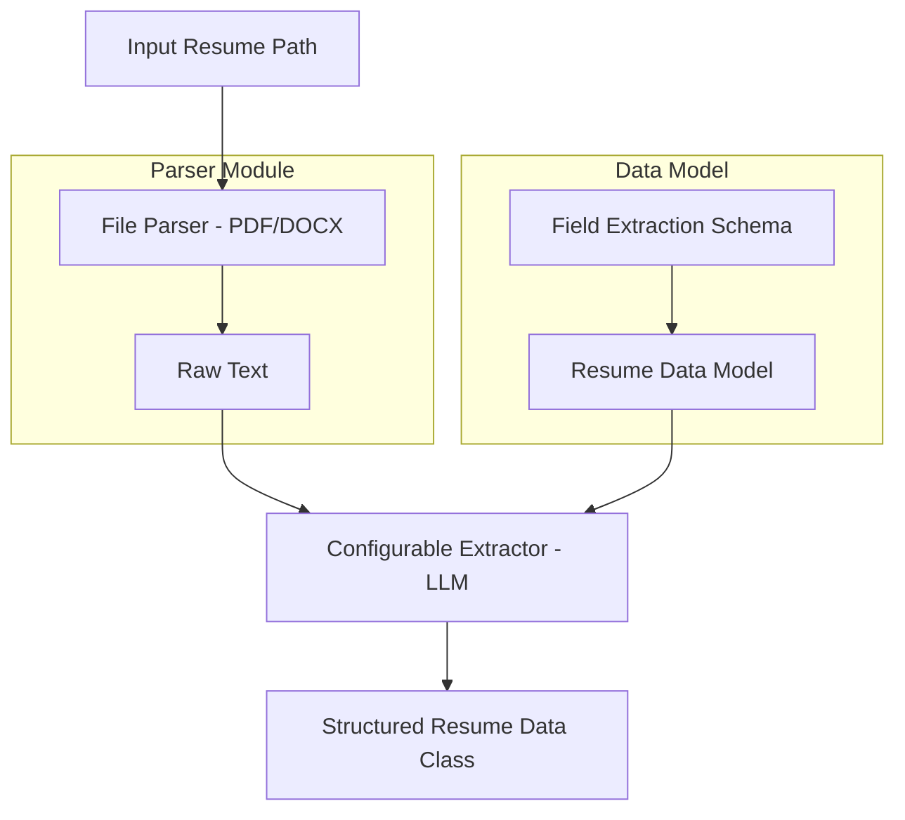

# Resume Parser

A Python-based resume parsing system that extracts structured information from resume documents.

## System Architecture



## Prerequisites

- Python 3.12 or higher
- uv (Python package installer)

## Getting Started

### Environment Setup

1. Clone the repository:

```bash
git clone https://github.com/dathpham/pr_resume_parser.git
cd pr_resume_parser
```

2. Create and activate a virtual environment:

```bash
uv venv
source .venv/bin/activate
```

### Installing Dependencies

Install the required packages using pip:

```bash
uv sync
```
### Environment Variable
```bash
cp .env.example .env
```
## Project Structure

```
pr_resume_parser/
├── pyproject.toml         # Project configuration
├── README.md             # Project documentation
├── resume_parser.py      # Main application file
├── datamodel/
│   └── extraction_model.py  # Data extraction and processing
├── parser/
│   └── file_parser.py      # File parsing utilities
└── test/
    └── test_all.py         # Test suite
```

## Usage

1. Place your resume file in the input directory
2. Run the parser:

```python
from resume_parser import ResumeParserFramework

extracted_data = ResumeParserFramework().parse_resume("sample.pdf")

print(extracted_data.model_dump_json(indent=2))
```
or with DOCX:

```python
from resume_parser import ResumeParserFramework

extracted_data = ResumeParserFramework().parse_resume("sample.docx")

print(extracted_data.model_dump_json(indent=2))
```

Output sample:

```
{
  "CandidateData": {
    "NameExtractor": "ken brit",
    "EmailExtractor": "kenbr@abc.ca",
    "SkillsExtractor": [
      "Machine Learning",
      "Deep Learning",
      "Cybersecurity",
      "Malware Detection",
      "Complexity Analysis",
      "Graph Neural Networks",
      "Intrusion Detection Systems",
      "Data Science",
      "PySpark",
      "Explainable AI",
      "Particle Swarm Optimization",
      "Combinatorial Optimization",
      "High Performance Chromatography",
      "Water Treatment",
      "Wastewater Treatment",
      "SCADA",
      "PLC",
      "OT Networking",
      "Firewall Configuration",
      "Project Management",
      "Environmental Engineering"
    ]
  }
}
```

## Running Tests

To run the test suite using pytest:

```bash
python -m pytest
```

## Linting

This project used pre-commit to lint the code.

Pre-commit is a tool that runs checks on your code before you commit it to your repository. If you install pre-commit in your repository, it will run the checks on your code every time you run git commit.

To install pre-commit run the following command:

```bash
pre-commit install
```

To run manually:

```bash
pre-commit run --all-files
```
